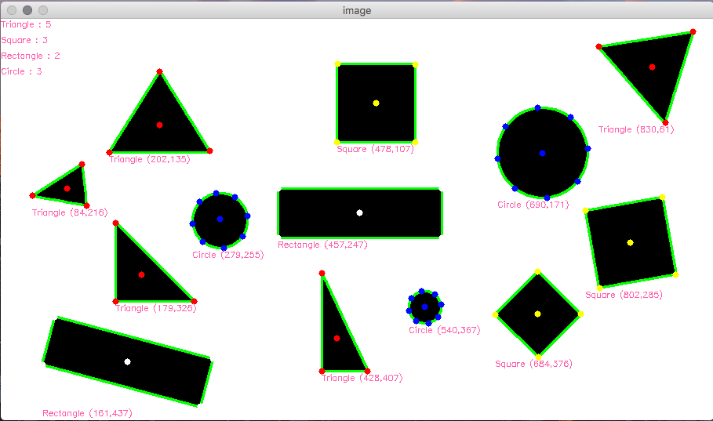

# Object Recognition (Shape Detection)
- threshold(input image,threshold value,maximum value)
  ใช้ปรับ threshold ของรูปภาพเพื่อที่จะทำให้คำนวนได้ง่ายขึ้น
- bitwise_not(input image)
  ใช้ Invert ภาพขาวดำ
- findContours(input image,Contour retrieval mode,Contour approximation method)
  ใช้ทำการหาเส้นขอบของรูปภาพ
- approxPolyDP(curve,epsilon,closed)
  ใช้หาตำแหน่งมุมของรูปภาพจากเส้นขอบ
  
  -----------------------------------------------
  ขั้นตอนการทำ
- แปลงรูปเป็นขาวดำเพื่อที่จะได้หาเส้นขอบได้ง่าย
- นำภาพมา GaussianBlur เพื่อทำให้จุดเล็กๆที่ขาดกันให้มาต่อกันเป็นเนื้อเดียวกัน
- Invert ภาพขาวดำ เพราะฟังก์ชันการหาเส้นขอบพื้นหลังจะต้องเป็นสีดำเท่านั้น
- นำภาพที่ได้มาทำการหาเส้นขอบโดยใช้ฟังก์ชัน findContours
- นำเส้นขอบของแต่ละรูปทรงมาทำการหามุมของรูปทรง โดยใช้ฟังก์ชัน approxPolyDP เพื่อที่จะระบุได้ว่าเป็นรูปทรงอะไร
- หาจุด centroid ของรูปทรงโดยใช้สูตร 

  โดยที่ x คือมุมของรูปทรงในแต่ละแกน k คือจำนวนมุมทั้งหมดของรูปทรง
- นำจุดที่ได้มาวาดจุดลงในรูป โดยใช้ฟังก์ชัน circle

